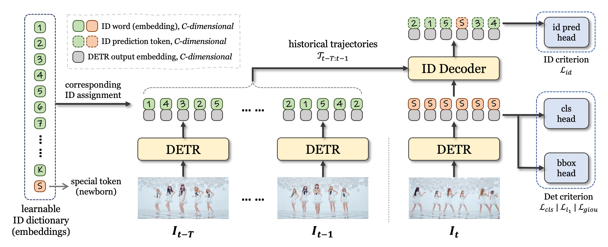

<h1 align="center">
  <i>Multiple Object Tracking as ID Prediction</i>
</h1>

<p align="center">
  <a href="https://ruopenggao.com" target='_blank'>Ruopeng Gao</a>,&nbsp;
  Ji Qi,&nbsp;
  <a href="https://wanglimin.github.io/" target='_blank'>Limin Wang</a>,&nbsp;
  <br>
  Nanjing University <br>
  📧 Primary Contact: ruopenggao@gmail.com
</p>

<p align="center">
  <a href="https://arxiv.org/abs/2403.16848" target='_blank'>
    
  </a>
  <a href="https://openaccess.thecvf.com/content/CVPR2025/html/Gao_Multiple_Object_Tracking_as_ID_Prediction_CVPR_2025_paper.html">
    
  </a>
  <a href="https://zhuanlan.zhihu.com/p/1907113772465759166">
    
  </a>
</p>


## :mag: Overview

**TL; DR.** We propose a novel perspective to ***regard the multiple object tracking task as an in-context ID prediction problem***. Given a set of trajectories carried with ID information, MOTIP directly decodes the ID labels for current detections, which is straightforward and effective.




## :fire: News

- <span style="font-variant-numeric: tabular-nums;">**2025.04.11**</span>: Support loading previous MOTIP checkpoints from the [prev-engine](https://github.com/MCG-NJU/MOTIP/tree/prev-engine) to inference :floppy_disk:. See [MODEL_ZOO](./docs/MODEL_ZOO.md) for details.
- <span style="font-variant-numeric: tabular-nums;">**2025.04.06**</span>: Now, you can use the [video demo](./demo/video_process.ipynb) to perform nearly real-time tracking on your videos :joystick:.
- <span style="font-variant-numeric: tabular-nums;">**2025.04.05**</span>: We support FP16 for faster inference :racing_car:.
- <span style="font-variant-numeric: tabular-nums;">**2025.04.03**</span>: The new codebase is released :tada:. Compared to the previous version, it is more concise and efficient :rocket:. Feel free to enjoy it!
- <span style="font-variant-numeric: tabular-nums;">**2025.03.25**</span>: Our revised paper is released at [arXiv:2403.16848](https://arxiv.org/abs/2403.16848). The latest codebase is being organized :construction:.
- <span style="font-variant-numeric: tabular-nums;">**2025.02.27**</span>: Our paper is accepted by CVPR 2025 :tada: :tada:. The revised paper and a more efficient codebase will be released in March. Almost there :nerd_face: ~
- <span style="font-variant-numeric: tabular-nums;">**2024.03.26**</span>: The first version of our paper is released at [arXiv:2403.16848v1](https://arxiv.org/abs/2403.16848v1) :pushpin:. The corresponding codebase is stored in the [prev-engine branch](https://github.com/MCG-NJU/MOTIP/tree/prev-engine) (No longer maintained starting April 2025 :no_entry:).

## :dash: Quick Start

- See [INSTALL.md](./docs/INSTALL.md) for instructions of installing required components.
- See [DATASET.md](./docs/DATASET.md) for datasets download and preparation.
- See [GET_STARTED.md](./docs/GET_STARTED.md) for how to get started with our MOTIP, including pre-training, training, and inference.
- See [MODEL_ZOO.md](./docs/MODEL_ZOO.md) for well-trained models.
- See [MISCELLANEOUS.md](./docs/MISCELLANEOUS.md) for other miscellaneous settings unrelated to the model structure, such as logging.

## :bouquet: Acknowledgements

This project is built upon [Deformable DETR](https://github.com/fundamentalvision/Deformable-DETR), [MOTR](https://github.com/megvii-research/MOTR), [TrackEval](https://github.com/JonathonLuiten/TrackEval). Thanks to the contributors of these great codebases.

## :pencil2: Citation

If you think this project is helpful, please feel free to leave a :star: and cite our paper:

```tex
@InProceedings{{MOTIP},
    author    = {Gao, Ruopeng and Qi, Ji and Wang, Limin},
    title     = {Multiple Object Tracking as ID Prediction},
    booktitle = {Proceedings of the Computer Vision and Pattern Recognition Conference (CVPR)},
    month     = {June},
    year      = {2025},
    pages     = {27883-27893}
}
```

## :star2: Stars

[](https://star-history.com/#MCG-NJU/MOTIP&Date)
